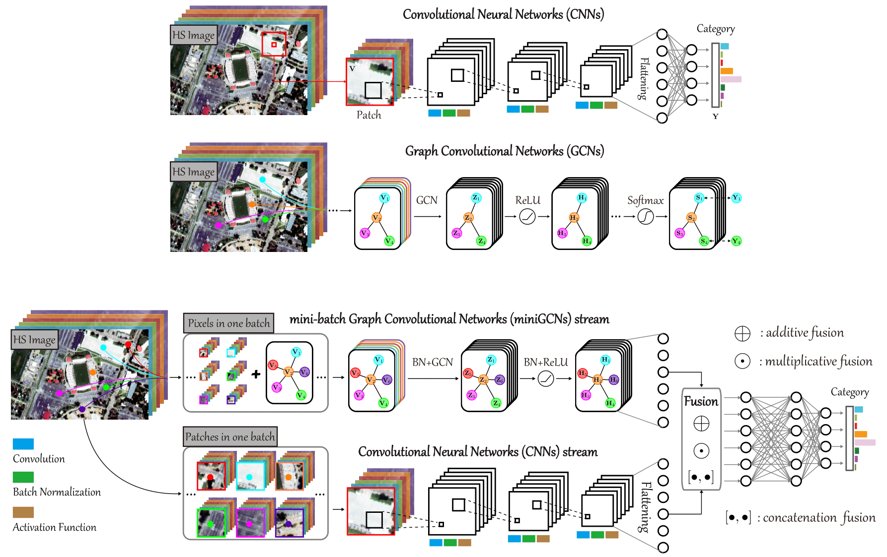

# Graph Convolutional Networks for Hyperspectral Image Classification

[Danfeng Hong](https://sites.google.com/view/danfeng-hong), [Lianru Gao](https://scholar.google.com/citations?user=f6OnhtcAAAAJ&hl=zh-CN), [Jing Yao](https://scholar.google.com/citations?user=1SHd5ygAAAAJ&hl=en), [Bing Zhang](http://english.radi.cas.cn/Education/PhDS/201401/t20140109_115415.html), [Antonio Plaza](https://www.umbc.edu/rssipl/people/aplaza/), [Jocelyn Chanussot](http://jocelyn-chanussot.net/)
---------------------

The code in this toolbox implements the ["Graph Convolutional Networks for Hyperspectral Image Classification"](https://ieeexplore.ieee.org/document/9120344).
More specifically, it is detailed as follow.

Citation
---------------------

**Please kindly cite the papers if this code is useful and helpful for your research.**

     @article{hong2020graph,
      title     = {Graph Convolutional Networks for Hyperspectral Image Classification},
      author    = {D. Hong and L. Gao and J. Yao and B. Zhang and A. Plaza and J. Chanussot},
      journal   = {IEEE Trans. Geosci. Remote Sens.}, 
      year      = {2020},
      note      = {DOI:10.1109/TGRS.2020.3015157}
      publisher = {IEEE}
     }

System-specific notes
---------------------
The data were generated by Matlab R2016a or higher versions, and the codes of various networks were tested in Tensorflow in Python 3.7 on Windows 10 machines.

How to use it?
---------------------

Here an example experiment is given by using Indian Pine data. Directly run .py functions with different networks to reproduce the results on the Indian Pine data, which exists in the aforementioned paper. Please note that we fixed the randomness of the parameter initialization to reproduce the unchanged results.

This toolbox consists of seven hyperspectral classification networks as follows

1DCNN: one-dimensional convolutional neural network;
2DCNN: two-dimensional convolutional neural network

If you want to run the code in your own data, you have to 

first of all, use the matlab functions in the folder of DataGenerate_Funciton to prepare the network input data;

next, change the save route or directly copy the generated data into the folder of HSI_CNN or HSI_GCN;

finally, run the .py networks.

If you encounter the bugs while using this code, please do not hesitate to contact us.

Licensing
---------

Copyright (C) 2020 Danfeng Hong

This program is free software: you can redistribute it and/or modify it under the terms of the GNU General Public License as published by the Free Software Foundation, version 3 of the License.

This program is distributed in the hope that it will be useful, but WITHOUT ANY WARRANTY; without even the implied warranty of MERCHANTABILITY or FITNESS FOR A PARTICULAR PURPOSE. See the GNU General Public License for more details.

You should have received a copy of the GNU General Public License along with this program.

Contact Information:
--------------------

Danfeng Hong: hongdanfeng1989@gmail.com 
Danfeng Hong is with the Univ. Grenoble Alpes, CNRS, Grenoble INP, GIPSA-lab, 38000 Grenoble, France.

